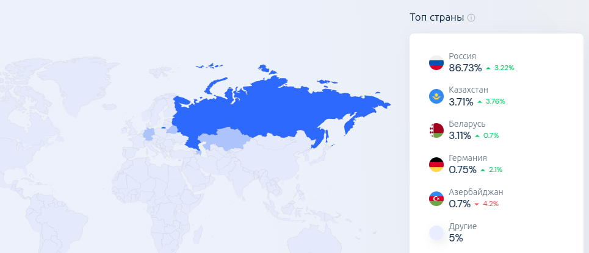
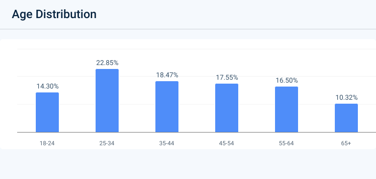

# Highload
Репозиторий курсовой работы по высоконагруженным системам от VK Education (ex. Технопарк).

---

[1. Тема и целевая аудитория](#1-тема-и-целевая-аудитория)

[Список использованных источников](#список-использованных-источников)

---

## 1. Тема и целевая аудитория[^1]

---

**Почта Mail** — служба электронной почты, основная служба портала Mail, принадлежащего компании VK.

### Число активных пользователей[^2]

  - MAU на 3 квартал 2024 года: 49 млн
  - DAU на 3 квартал 2024 года: 16,2 млн

### Целевая аудитория[^3]

- По странам:

  

- По возрасту:

  

- По полу:

  

### Требования к функционалу
- MVP:
    - Регистрация и авторизация
    - Просмотр почты
    - Написание письма
    - Организация писем 
    - Удаление (перенос в корзину, удаление из корзины)
    - Уведомления

---

## Список использованных источников

[^1]: https://ru.m.wikipedia.org/wiki/Почта_Mail
[^2]: https://corp.vkcdn.ru/media/files/RUS_Press_Release_9M_2024.pdf
[^3]: https://pro.similarweb.com/
