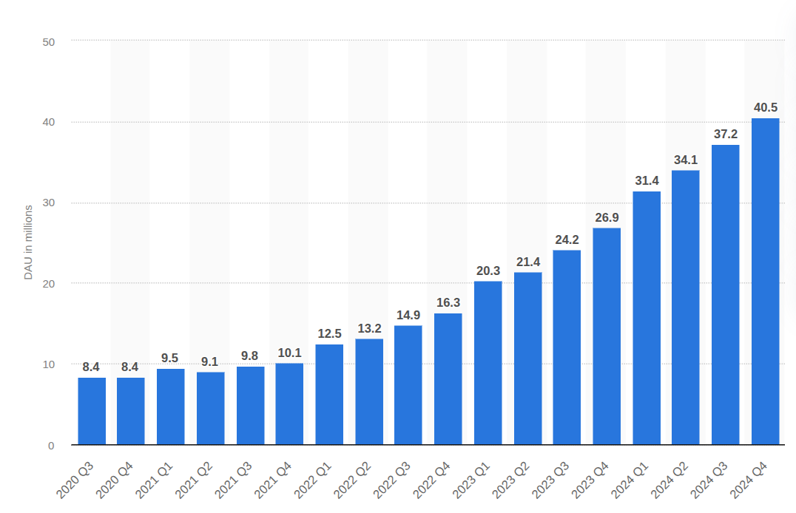
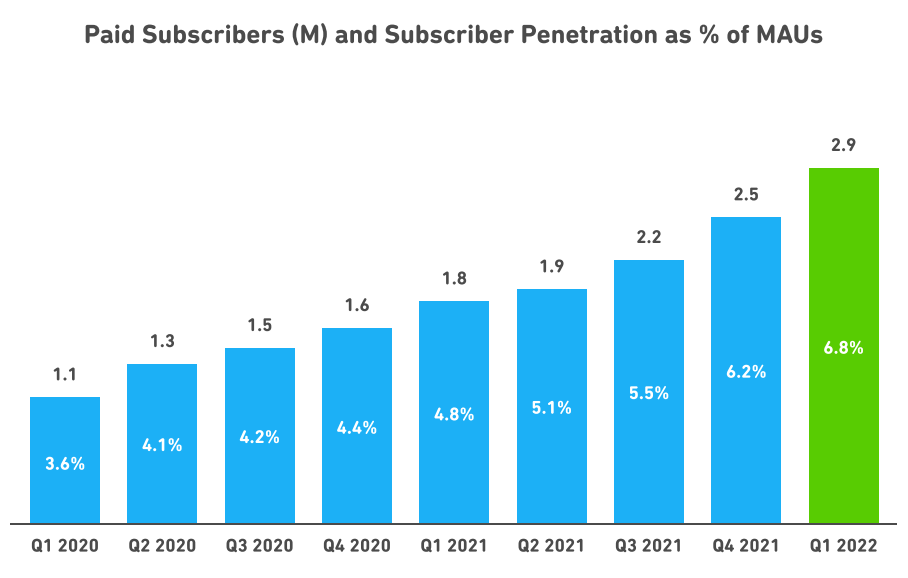
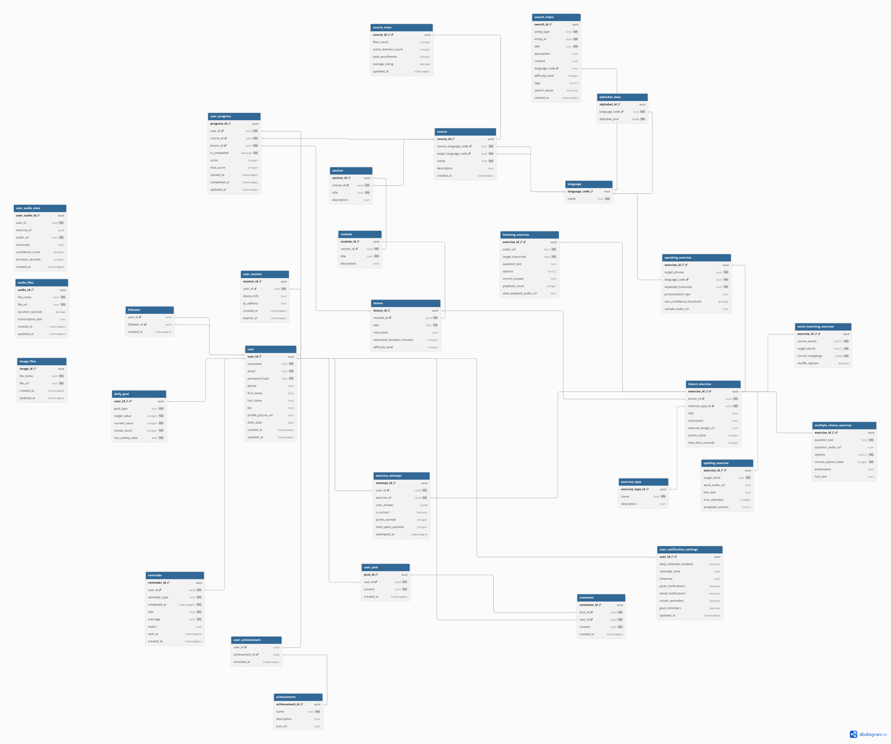
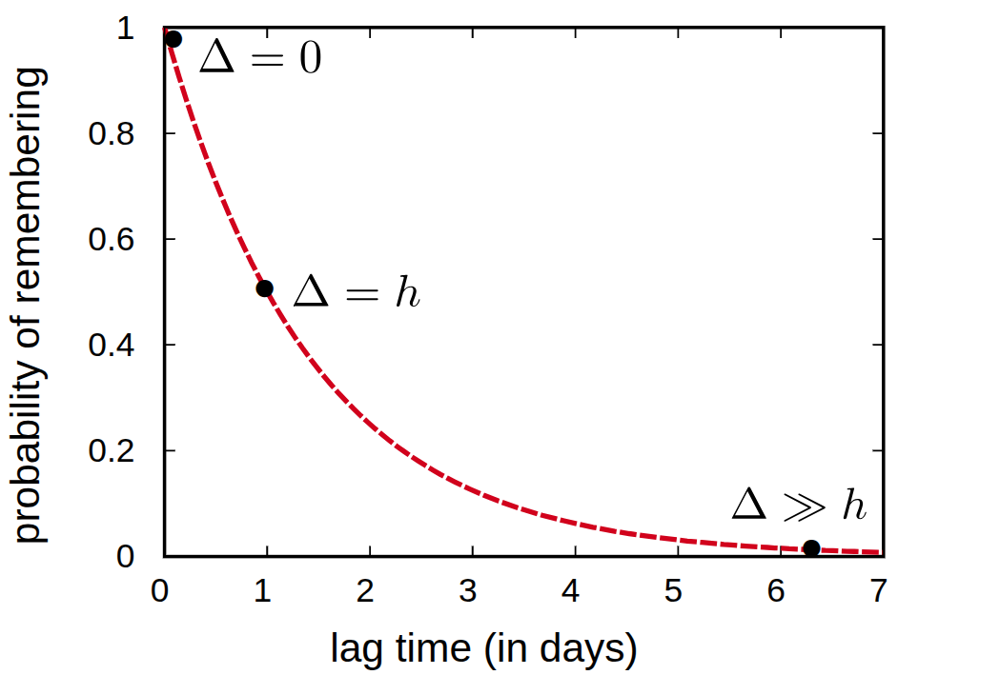
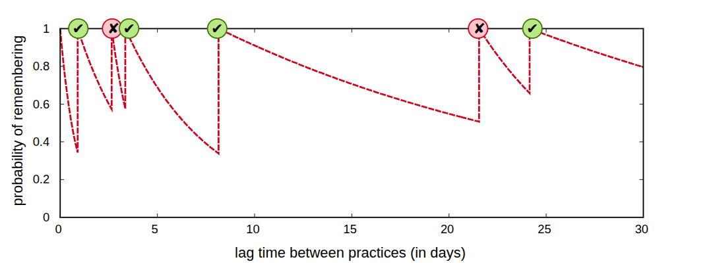

# Highload

[Задание](https://github.com/init/highload/blob/main/homework_architecture.md)

Репозиторий курсовой работы по дисциплине "Проектирование высоконагруженных систем"

- [**1. Тема и целевая аудитория**](#1-тема-и-целевая-аудитория)
- [**2. Расчет нагрузки**](#2-расчет-нагрузки)
- [**3. Глобальная балансировка нагрузки**](#3-глобальная-балансировка-нагрузки)
- [**4. Локальная балансировка нагрузки**](#4-локальная-балансировка-нагрузки)
- [**5. Логическая схема БД**](#5-логическая-схема-бд)
- [**6. Физическая схема БД**](#6-физическая-схема-бд)
- [**7. Алгоритмы**](#7-алгоритмы)
- [**8. Технологии**](#7-технологии)
- [**Список использованных источников**](#список-использованных-источников)

## 1. Тема и целевая аудитория

Duolingo — бесплатная платформа для изучения языков, также имеющая курсы математики, музыки и шахматам[[1](https://ru.wikipedia.org/wiki/Duolingo)].

### Число активных пользователей

  * MAU на 1 квартал 2022 года: 49,2 млн[[2](https://investors.duolingo.com/static-files/d667f9d1-8f7f-418c-b116-e699a30a9826)]
  * DAU на 1 квартал 2022 года: 12,5 млн 
  * Средняя продолжительность посещения: 15 минут 39 секунд [[3](https://usesignhouse.com/blog/duolingo-stats/)]

### Целевая аудитория

* По странам[[4](https://usesignhouse.com/blog/duolingo-stats/)]:

  
  Всего пользователей: 575 млн[[5](https://cooljugator.com/blog/duolingo-statistics/)]

### Требования к функционалу
  * Регистрация и авторизация
  * Выбор языка для изучения
  * Уроки (с делением на разделы и модули)
    - множественный выбор
    - сопоставление слов
    - аудирование
    - говорение
    - правописание
  * Система прогресса 
  * Ежедневная цель и трекер
  * Система напоминаний
  * Подписки, добавление в друзья, комментарии
  * Алфавит
  * Возможность изменения уроков их авторами

## 2. Расчет нагрузки

| Метрика                          | Значение    |
|:---------------------------------|:------------| 
| Месячная аудитория (MAU)         | 49,2 млн    |
| Дневная аудитория (DAU)          | 12,5 млн    | 
| Средняя продолжительность сессии | 15,65 минут | 

### Размер хранения в разбивке по типам данных

- Прирост в день:[[8](https://www.statista.com/statistics/1309604/duolingo-quarterly-dau/)]
  
- Прирост в месяц:
  

Согласно источнику[[6](https://hu.duolingo.com/privacy)], хранятся следующие индивидуальные пользовательские данные:
- основной профиль и учетные данные: возраст, email, номер телефона, имя, фамилия, биография, фото профиля;
- учебный прогресс и активность: изучаемые языки, статистика, достижения, история пройденных уроков и упражнений;
- пользовательский контент: комментарии на профиле;
- аудиоданные и транскрипты: аудиозаписи голоса с упражнений на произношение;
- cоциальные графы: cписки подписчиков и подписок.

Формулы:
- новых пользователей в день ≈ (DAU_конечное - DAU_начальное) / количество дней в периоде
- прирост в день ед/день = ед/пользователя × новых пользователей в день
- прирост в день объем/день = ед/день × средний размер единицы
- прирост в месяц ед/мес = ед/пользователя × новых пользователей в месяц
- прирост в месяц объем/мес = ед/мес × средний размер единицы

Новых пользователей в день: 
- (12.5 млн - 10.1 млн) / 90 дней = 2.4 млн / 90 = 26,667 пользователей/день

Новых пользователей в месяц:
- 26,700 пользователей/день × 30 дней = 801,000 пользователей/месяц

| Хранимые данные                   | Средний размер единицы | Ед/пользователя | Сколько единиц | Суммарный объем  | Прирост в день | Прирост в месяц |
|:----------------------------------|:-----------------------|:----------------|:---------------|:-----------------|:---------------|:----------------|
| Основной профиль и учетные данные | 5 КБ                   | 1               | 49,200,000     | 234.5 ГБ         | 130.4 МБ       | 3.8 ГБ          |
| Учебный прогресс и активность     | 50 КБ                  | 1               | 49,200,000     | 2.3 ТБ           | 1.3 ГБ         | 38.2 ГБ         |
| Пользовательский контент          | 2 КБ                   | 5               | 246,000,000    | 468.9 ГБ         | 260.7 МБ       | 7.6 ГБ          |
| Аудиоданные и транскрипты         | 4.8 МБ                 | 1               | 49,200,000     | 225.2 ТБ         | 125.1 ГБ       | 3.7 ТБ          |
| Социальные графы                  | 1 КБ                   | 5               | 492,000,000    | 468.9 ГБ         | 260.7 МБ       | 7.6 ГБ          |

Основной профиль и учетные данные:
- Сколько единиц: MAU (49.2 млн) × 1 = 49,200,000
- Суммарный объем: (49,200,000 × 5 КБ) / (1024×1024) = 234.5 ГБ
- Прирост в день: (26,700 × 5 КБ) / 1024 = 130.4 МБ
- Прирост в месяц: 130.4 МБ × 30 = 3.8 ГБ

Учебный прогресс и активность:
- Суммарный объем: (49,200,000 × 50 КБ) / (1024×1024) = 2.3 ТБ
- Прирост в день: (26,700 × 50 КБ) / 1024 = 1.3 ГБ

Пользовательский контент:
- Сколько единиц: MAU (49.2 млн) × 5 = 246,000,000
- Суммарный объем: (246,000,000 × 2 КБ) / (1024×1024) = 468.9 ГБ
- Прирост в день: (26,700 × 5 × 2 КБ) / 1024 = 260.7 МБ

Аудиоданные и транскрипты:
- Размер единицы: 2.4 МБ/мин × 2 минуты = 4.8 МБ
- Сколько единиц: MAU (49.2 млн) × 1 = 49,200,000
- Суммарный объем: (49,200,000 × 4.8 МБ) / 1024 = 225.2 ТБ
- Прирост в день: (26,700 × 4.8 МБ) / 1024 = 125.1 ГБ
- Прирост в месяц: 125.1 ГБ × 30 = 3.7 ТБ

Социальные графы:
- Сколько единиц: MAU (49.2 млн) × 10 = 492,000,000
- Суммарный объем: (492,000,000 × 1 КБ) / (1024×1024) = 468.9 ГБ
- Прирост в день: (26,700 × 10 × 1 КБ) / 1024 = 260.7 МБ
   
Допущения:
- Высокое качество(320kbps) аудиозаписи: 2,40 МБ/мин [[7](https://digitark.telia.ee/ru/era/%D0%B2%D1%81%D0%B5-%D1%82%D0%BE%D1%87%D0%BA%D0%B8-%D0%BD%D0%B0%D0%B4-%D0%B8%D1%82-%D0%BA%D0%B0%D0%BA-%D0%B2%D1%8B%D0%B1%D1%80%D0%B0%D1%82%D1%8C-%D0%BE%D0%B1%D1%8A%D0%B5%D0%BC-%D0%BC%D0%BE/#:~:text=%D0%9D%D0%B8%D0%B7%D0%BA%D0%BE%D0%B5%20%D0%BA%D0%B0%D1%87%D0%B5%D1%81%D1%82%D0%B2%D0%BE%20%D0%B0%D1%83%D0%B4%D0%B8%D0%BE%20(96kpps)%20%D0%B8%D1%81%D0%BF%D0%BE%D0%BB%D1%8C%D0%B7%D1%83%D0%B5%D1%82,115%2C2%20%D0%9C%D0%B1%20%D0%B2%20%D1%87%D0%B0%D1%81.)]
- На говорение тратится ~2 минуты за сессию.

### RPS в разбивке по типам запросов

Формулы:
- суммарные действия в день = действий в день на пользователя ×  DAU
- средний RPS = суммарные действия в день / 86 400 (секунд в дне)

| Категория                 | Действие                           | Среднее количество в день             | Суммарные действия в день | Средний RPS |
|:--------------------------|:-----------------------------------|:--------------------------------------|:--------------------------|:------------|
| Регистрация и авторизация |                                    |                                       |                           |             |
|                           | Вход в аккаунт                     | 2                                     | 25 000 000                | ~289.4      |
| Работа с уроками          |                                    |                                       |                           |             |
|                           | Прохождение карточек / множ. выбор | 12                                    | 150 000 000               | ~1736.1     | 
|                           | Сопоставление слов                 | 5                                     | 62 500 000                | ~723.4      | 
|                           | Аудирование                        | 4                                     | 50 000 000                | ~578.7      | 
|                           | Говорение (произношение)           | 3                                     | 37 500 000                | ~434.0      | 
|                           | Правописание (ввод слова)          | 4                                     | 50 000 000                | ~578.7      | 
|                           | ИТОГО по урокам                    | 28                                    | 350 000 000               | ~4050.9     | 
| Система прогресса         |                                    |                                       |                           |             | 
|                           | Просмотр статистики                | 1                                     | 12 500 000                | ~144.7      | 
| Ежедневная цель           |                                    |                                       |                           |             |  
|                           | Отметка о выполнении               | 1                                     | 12 500 000                | ~144.7      |
| Система напоминаний       |                                    |                                       |                           |             |
|                           | Клик по push-уведомлению           | 0.5                                   | 6 250 000                 | ~72.3       |
| Социальные функции        |                                    |                                       |                           |             | 
|                           | Запрос на дружбу                   | 0.3                                   | 3 750 000                 | ~43.4       |
|                           | Комментарии                        | 1.5                                   | 18 750 000                | ~217.0      |
|                           | Просмотр профилей                  | 1                                     | 12 500 000                | ~144.7      |
|                           | ИТОГО по соц. функциям             | 2.8                                   | 35 000 000                | ~405.1      |
| Вспомогательные функции   |                                    |                                       |                           |             |
|                           | Просмотр алфавита                  | 0.2                                   | 2 500 000                 | ~28.9       |
|                           | Изменение уроков (автор)           | 0.1                                   | 1 250 000                 | ~14.5       |
|                           | ВСЕГО СУММАРНО                     | 35.7                                  | ~446 250 000              | ~5165.9     |

### Сетевой трафик

Формулы:
- нагрузка Гбит/с = (средний трафик на действие Кб × RPS × 8) / 1024 × 1024

| Действие                     | КБ на действие | RPS     | Нагрузка (Гбит/с) | Нагрузка (Гбит/день) |
|:-----------------------------|:---------------|:--------|:------------------|:---------------------|
| Вход в аккаунт               | 2              | 289.4   | 0.45              | 381.47               |
| Прохождение карточек         | 8              | 1,736.1 | 10.85             | 9,155.27             |
| Сопоставление слов           | 12             | 723.4   | 6.78              | 5,722.05             |
| Аудирование                  | 15             | 578.7   | 6.78              | 5,722.05             |
| Говорение                    | 5              | 434.0   | 1.70              | 1,430.51             |
| Правописание                 | 3              | 578.7   | 1.36              | 1,144.41             |
| Просмотр статистики          | 25             | 144.7   | 28.26             | 2,384.19             |
| Отметка о выполнении         | 1              | 144.7   | 1.13              | 95.37                |
| Клик по push-уведомлению     | 1              | 72.3    | 0.56              | 47.68                |
| Запрос на дружбу             | 2              | 43.4    | 0.68              | 57.22                |
| Комментарии                  | 8              | 217.0   | 13.56             | 1,144.41             |
| Просмотр профилей            | 15             | 144.7   | 16.96             | 1,430.51             |
| Просмотр алфавита            | 50             | 28.9    | 11.29             | 953.67               |
| Изменение уроков             | 100            | 14.5    | 11.33             | 953.67               |
| ВСЕГО СУММАРНО               | -              | 5,165.9 | 111.69            | 31,123.88            |

Вход в аккаунт:
- (2 КБ × 289.4 RPS × 8) / 1024 = 0.45 Гбит/с

Прохождение карточек:
- (8 КБ × 1,736.1 RPS × 8) / 1024 = 10.85 Гбит/с

Сопоставление слов:
- (12 КБ × 723.4 RPS × 8) / 1024 = 6.78 Гбит/с

Аудирование:
- (15 КБ × 578.7 RPS × 8) / 1024 = 6.78 Гбит/с

Просмотр статистики:
- (25 КБ × 144.7 RPS × 8) / 1024 = 28.26 Гбит/с

Изменение уроков:
- (100 КБ × 14.5 RPS × 8) / 1024 = 11.33 Гбит/с

| Метрика                      | Значение                                |
|:-----------------------------|:----------------------------------------|
| Общий суточный трафик        | 31,123.88 Гбит/день (см. табл. трафика) |
| Трафик на пользователя       | 0.305 МБ/день                           |
| Средний размер действия      | 8.75 КБ                                 |
| Действий на пользователя     | 35.7 действий/день (см. табл. RPS)      |

Средний размер на действие:
- 31,123,880 Мбит ÷ 446,250,000 действий ≈ 0.07 Мбит/действие = 8.75 КБ/действие

Трафик на пользователя:
- 35.7 действий/день × 8.75 КБ/действие = 312.4 КБ/день = 0.305 МБ/день

### Пиковый коэффициент и коэффициент надежности

Формулы:
- kпик = пиковая нагрузка / средняя нагрузка
- kнадежн = доступные ресурсы / необходимые ресурсы

Пиковая нагрузка:
- 111.69 Гбит/с × 2 = 223.38 Гбит/с 
Нагрузка с резервом:
- 31,123,880 Мбит × 1.5 = 35.07 Гбит/с

Допущения:
- kпик = 2
- kнадежн = 1.25

## 3. Глобальная балансировка нагрузки

### Функциональное разбиение по доменам

Отсутствует

### Обоснование расположения ДЦ (влияние на продуктовые метрики)

Из статистики получаем, что большая часть аудитории приходится на США, Бразилию, Великобританию, Мексику, поэтому распределим ДЦ следующим образом:

| Регион                   | Ключевые ДЦ                              | Покрытие                                    | Доля |
|:-------------------------|:-----------------------------------------|:--------------------------------------------|:-----|
| США                      | Вирджиния, Орегон, Техас                 | США, Канада, Мексика                        | ~26% |
| Бразилия                 | Сан-Паулу                                | Бразилия, Латинская Америка                 | ~7%  |
| Великобритания, Германия | Лондон, Франкфурт                        | Великобритания, Германия, Франция, Бенилюкс | ~10% |
| Польша                   | Варшава                                  | Восточная Европа, Россия, СНГ               | ~5%  |              

#### США: 

- Крупнейший рынок. Несколько ДЦ для снижения задержки и обеспечения отказоустойчивости. Вирджиния - восточное побережье, Орегон - западное побережье, Техас - центр и юг.

#### Бразилия:

- Центральное расположение для покрытия всего региона. Сан-Паулу - крупнейший технологический хаб Южной Америки.

#### Великобритания, Германия:

- Два ключевых технологических хаба для покрытия основных рынков Европы. Лондон - западная Европа, Франкфурт - центральная Европа.

#### Польша:

- Центральное расположение для покрытия восточноевропейского региона с оптимальной задержкой для всех стран.

### Расчет распределение запросов по типам запросов по ДЦ

| Действие                               | Требование к задержке | Методы распределения в GSLB |
|:---------------------------------------|:----------------------|:----------------------------|
| Регистрация, авторизация               | низкая                | наименее загруженный ДЦ     |
| Главная страница, загрузка уроков      | средняя               | наименее загруженный ДЦ     |
| Упражнения на произношение             | критично важная       | ДЦ с наименьшей задержкой   |
| Упражнения на правописание             | критично важная       | ДЦ с наименьшей задержкой   |
| Прослушивание аудиозаписей, упражнения | средняя               | ближайшая геолокация        |

### Схема DNS балансировки

Для распределения пользователей между ДЦ на разных континентах будет использоваться Geo-based DNS. 

Этот метод предпочтительнее простого Round-Robin, так как серверы находятся в разных полушариях и задержки между ними велики. 

DNS-система направляет пользователя в географически ближайший дата-центр

### Схема Anycast балансировки

Внутри крупных регионов, таких как Северная Америка и Европа, DNS-балансировка может быть недостаточно точной из-за того, что провайдеры часто используют глобальные DNS-серверы, не учитывающие задержки между городами. 

Поэтому здесь будет применяться BGP Anycast.
Один и тот же IP-адрес анонсируется в интернет сразу из нескольких ДЦ. Протокол маршрутизации BGP автоматически направляет трафик пользователя в топологически ближайший ДЦ. Это минимизирует задержку для конечных пользователей.

Для реализации требуется собственный номер автономной системы (AS) и согласование с вышестоящими провайдерами.

### Механизм регулировки трафика между ДЦ

В зонах покрытия, где пользователи могут быть обслужены разными ДЦ (например, на границе их ответственности), трафик будет динамически перераспределяться в зависимости от текущей загрузки каждого ДЦ. Это обеспечивает оптимальное использование ресурсов и отказоустойчивость.

## 4. Локальная балансировка нагрузки

В каждом ДЦ развернут кластер Kubernetes, который обеспечивает оркестрацию и базовое управление состоянием сервисов.

Для балансировки трафика между подами внутри кластера используется каскадная схема L4 → L7

### Аудио-стриминг (упражнения на аудирование и говорение)

Для обработки аудиопотоков в реальном времени, критичных к задержкам, применяется балансировка нагрузки на транспортном уровне L4.
В качестве базового решения используется технология LVS (Linux Virtual Server) с методом маршрутизации Direct Routing (DR).
Данный подход обеспечивает максимальную производительность за счет того, что ответные пакеты от серверов приложений передаются напрямую клиенту,
минуя балансировщик на обратном пути.
Важным условием работы в этом режиме является размещение всех серверов в пределах одной физической сети (broadcast-домена).
Алгоритм балансировки реализован через модуль NGINX stream с применением стратегии Least Connections, 
которая гарантирует распределение новых входящих аудиосоединений на серверы с наименьшим количеством активных подключений, 
что особенно эффективно для долгоживущих медиасессий.

### HTTP/HTTPS запросы (Веб-интерфейс, API, прогресс)

Для основного веб-трафика, требующего интеллектуальной маршрутизации, применяется балансировка нагрузки на уровне приложений L7. 
В качестве технологического решения используется NGINX Ingress Controller, развернутый в кластере Kubernetes. 
Алгоритм балансировки построен по принципу наименьших соединений Least Connections, 
когда каждый новый запрос направляется на бэкенд с минимальным количеством активных подключений, 
что обеспечивает равномерное распределение нагрузки для запросов различной продолжительности.
Балансировщик уровня L7 выполняет критически важные функции, включая SSL Termination - расшифровку HTTPS-трафика с последующей передачей данных бэкендам по HTTP, 
что значительно разгружает серверы приложений от ресурсоемких операций шифрования. 
Важной особенностью является буферизация запросов и ответов, которая обеспечивает защиту бэкендов от медленных клиентов. 
Также реализована интеллектуальная маршрутизация на основе путей запросов, позволяющая направлять трафик к различным сервисам в зависимости от URL.

### Резервирование и отказоустойчивость

Для обеспечения высокой доступности применяется многоуровневая стратегия резервирования.

- Схема резервирования: N+1. На каждый ДЦ резервируется один дополнительный балансировщик каждого типа сверх необходимого по расчетной нагрузке.
- Механизм отказоустойчивости: Для L4-балансировщиков (LVS) используется Keepalived. Этот протокол реализует механизм Virtual Router Redundancy Protocol (VRRP), 
который непрерывно проверяет доступность активного балансировщика и автоматически заменяет его резервным в случае падения, обеспечивая бесперебойную работу.

### Расчет необходимого количества балансировщиков

Формула для L4-балансировщиков:
- N (L4) = ceil(Пиковая нагрузка на ДЦ (Гбит/с) / 100) + 1

| Расположение ДЦ | Регион                   | Пиковая нагрузка (Гбит/с) | N (L4) | N (L7) |
|-----------------|--------------------------|---------------------------|--------|--------|
| Вирджиния       | США                      | 150                       | 3      | 2      |
| Орегон          | США                      | 100                       | 2      | 2      |
| Техас           | США                      | 100                       | 2      | 2      |
| Сан-Паулу       | Бразилия                 | 50                        | 2      | 2      |
| Лондон          | Великобритания, Германия | 80                        | 2      | 2      |
| Франкфурт       | Великобритания, Германия | 80                        | 2      | 2      |
| Варшава         | Польша                   | 30                        | 2      | 2      |

## 5. Логическая схема БД

### Описание таблиц
#### Таблица Пользователи
| Поле                            | Тип данных  | Размер (байт) | Описание                              |
|---------------------------------|-------------|---------------|---------------------------------------|
| user_id                         | UUID        | 16            | Уникальный идентификатор пользователя |
| username                        | TEXT        | 50            | Логин для входа в систему             |
| email                           | TEXT        | 100           | Электронная почта                     |
| password_hash                   | TEXT        | 60            | Хеш пароля                            |
| phone                           | TEXT        | 20            | Номер телефона (опционально)          |
| first_name                      | TEXT        | 50            | Имя пользователя                      |
| last_name                       | TEXT        | 50            | Фамилия пользователя                  |
| bio                             | TEXT        | 500           | Биография "о себе"                    |
| profile_picture_url             | TEXT        | 200           | Ссылка на аватарку                    |
| birth_date                      | DATE        | 4             | Дата рождения                         |
| created_at                      | TIMESTAMPTZ | 8             | Дата регистрации                      |
| updated_at                      | TIMESTAMPTZ | 8             | Дата последнего обновления            |

#### Таблица Сессии
| Поле        | Тип данных  | Размер (байт) | Описание                 |
|-------------|-------------|---------------|--------------------------|
| session_id  | UUID        | 16            | ID сессии                |
| user_id     | UUID        | 16            | Ссылка на пользователя   |
| device_info | TEXT        | 50-200        | Информация об устройстве |
| ip_address  | TEXT        | 15-45         | IP адрес                 |
| created_at  | TIMESTAMPTZ | 8             | Время создания           |
| expires_at  | TIMESTAMPTZ | 8             | Время истечения          |

#### Таблица  файлов Изображений
| Поле       | Тип данных  | Размер (байт) | Описание                                  |
|------------|-------------|---------------|-------------------------------------------|
| image_id   | UUID        | 16            | Уникальный идентификатор изображения (PK) |
| file_name  | TEXT        | 255           | Оригинальное имя файла                    |
| file_url   | TEXT        | 500           | Публичный URL для доступа к изображению   |
| created_at | TIMESTAMPTZ | 8             | Дата создания записи                      |
| updated_at | TIMESTAMPTZ | 8             | Дата последнего обновления                |

### Таблица Аудио файлов
| Поле               | Тип данных  | Размер (байт) | Описание                                  |
|--------------------|-------------|---------------|-------------------------------------------|
| audio_id           | UUID        | 16            | Уникальный идентификатор аудиофайла (PK)  |
| file_name          | TEXT        | 255           | Оригинальное имя файла                    |
| file_url           | TEXT        | 500           | Публичный URL для доступа к аудио         |
| duration_seconds   | DECIMAL     | 8             | Длительность аудио в секундах             |
| transcription_text | TEXT        | 5000          | Транскрипция аудио (текстовое содержание) |
| created_at         | TIMESTAMPTZ | 8             | Дата создания записи                      |
| updated_at         | TIMESTAMPTZ | 8             | Дата последнего обновления                |

#### Таблица Языки
| Поле        | Тип данных  | Размер (байт) | Описание                            |
|-------------|-------------|---------------|-------------------------------------|
| code        | TEXT        | 5             | Код языка                           |
| name        | TEXT        | 20            | Название языка                      |

#### Таблица Курсы
| Поле               | Тип данных  | Размер (байт) | Описание                       |
|--------------------|-------------|---------------|--------------------------------|
| course_id          | UUID        | 16            | Уникальный идентификатор курса |
| source_language_id | UUID        | 16            | Исходный язык пользователя     |
| target_language_id | UUID        | 16            | Язык для изучения              |
| name               | TEXT        | 100           | Название курса                 |
| description        | TEXT        | 500           | Описание курса                 |
| created_at         | TIMESTAMPTZ | 8             | Дата создания курса            |

#### Таблица счетчиков курсов
| Поле                  | Тип данных  | Размер (байт) | Описание                              |
|-----------------------|-------------|---------------|---------------------------------------|
| course_id             | UUID        | 16            | Уникальный идентификатор курса (PK)   |
| likes_count           | INTEGER     | 4             | Количество лайков курса               |
| active_learners_count | INTEGER     | 4             | Количество активных учеников          |
| total_enrollments     | INTEGER     | 4             | Общее количество записей на курс      |
| average_rating        | DECIMAL     | 8             | Средний рейтинг курса                 |
| updated_at            | TIMESTAMPTZ | 8             | Дата последнего обновления статистики |

#### Таблица Разделы курса
| Поле        | Тип данных | Размер (байт) | Описание                         |
|-------------|------------|---------------|----------------------------------|
| section_id  | UUID       | 16            | Уникальный идентификатор раздела |
| course_id   | UUID       | 16            | ID курса                         |
| title       | TEXT       | 100           | Название раздела                 |
| description | TEXT       | 300           | Описание раздела                 |

#### Таблица Модули
| Поле        | Тип данных | Размер (байт) | Описание                        |
|-------------|------------|---------------|---------------------------------|
| module_id   | UUID       | 16            | Уникальный идентификатор модуля |
| section_id  | UUID       | 16            | ID раздела                      |
| title       | TEXT       | 100           | Название модуля                 |
| description | TEXT       | 300           | Описание модуля                 |

#### Таблица Уроки
| Поле                       | Тип данных | Размер (байт) | Описание                       |
|----------------------------|------------|---------------|--------------------------------|
| lesson_id                  | UUID       | 16            | Уникальный идентификатор урока |
| module_id                  | UUID       | 16            | ID модуля                      |
| title                      | TEXT       | 100           | Название урока                 |
| instruction                | TEXT       | 200           | Инструкция к уроку             |
| estimated_duration_minutes | INTEGER    | 4             | Примерная длительность         |
| difficulty_level           | INTEGER    | 4             | Уровень сложности (1-5)        |

#### Таблица Типы упражнений
| Поле              | Тип данных | Размер (байт) | Описание                  |
|-------------------|------------|---------------|---------------------------|
| exercise_type_id  | UUID       | 16            | Уникальный идентификатор  |
| name              | TEXT       | 20            | Название типа             |
| description       | TEXT       | 100           | Описание типа             |

#### Таблица Упражнения уроков
| Поле                | Тип данных | Размер (байт) | Описание                  |
|---------------------|------------|---------------|---------------------------|
| exercise_id         | UUID       | 16            | Уникальный идентификатор  |
| lesson_id           | UUID       | 16            | ID урока                  |
| exercise_type_id    | UUID       | 16            | Тип упражнения            |
| title               | TEXT       | 100           | Название упражнения       |
| instruction         | TEXT       | 200           | Инструкция                |
| exercise_image_url  | TEXT       | 200           | URL изображения вопроса   |
| points_value        | INTEGER    | 4             | Баллы за выполнение       |
| time_limit_seconds  | INTEGER    | 4             | Лимит времени             |

#### Таблица Упражнения с множественным выбором
| Поле                  | Тип данных | Размер (байт) | Описание                  |
|-----------------------|------------|---------------|---------------------------|
| exercise_id           | UUID       | 16            | ID упражнения             |
| question_text         | TEXT       | 200           | Текст вопроса             |
| question_audio_url    | TEXT       | 200           | Аудио вопроса             |
| options               | TEXT[]     | 200           | Варианты ответов          |
| correct_option_index  | INTEGER    | 4             | Индекс правильного ответа |
| explanation           | TEXT       | 300           | Объяснение                |
| hint_text             | TEXT       | 100           | Подсказка                 |

#### Таблица Упражнения на сопоставление слов
| Поле              | Тип данных | Размер (байт) | Описание                  |
|-------------------|-----------|---------------|---------------------------|
| exercise_id       | UUID      | 16            | ID упражнения             |
| source_words      | TEXT[]    | 200           | Слова на исходном языке   |
| target_words      | TEXT[]    | 200           | Слова на целевом языке    |
| correct_mappings  | JSON      | 500           | Правильные сопоставления  |
| shuffle_options   | BOOLEAN   | 1             | Перемешивать варианты     |

#### Таблица Упражнения на аудирование
| Поле              | Тип данных | Размер (байт) | Описание                  |
|-------------------|------------|---------------|---------------------------|
| exercise_id       | UUID       | 16            | ID упражнения             |
| audio_url         | TEXT       | 200           | Ссылка на аудио           |
| target_transcript | TEXT       | 500           | Транскрипт                |
| question_text     | TEXT       | 200           | Вопрос                    |
| options           | TEXT[]     | 200           | Варианты ответов          |
| correct_answer    | TEXT       | 50            | Правильный ответ          |
| playback_count    | INTEGER    | 4             | Количество прослушиваний  |
| slow_playback_url | TEXT       | 200           | Медленное воспроизведение |

#### Таблица Упражнения на говорение
| Поле                      | Тип данных | Размер (байт) | Описание                |
|---------------------------|------------|---------------|-------------------------|
| exercise_id               | UUID       | 16            | ID упражнения           |
| target_phrase             | TEXT       | 100           | Целевая фраза           |
| language_code             | TEXT       | 5             | Код языка               |
| expected_transcript       | TEXT       | 200           | Ожидаемый транскрипт    |
| pronunciation_tips        | TEXT       | 200           | Советы по произношению  |
| min_confidence_threshold  | DECIMAL    | 4             | Минимальная уверенность |
| sample_audio_url          | TEXT       | 200           | Пример произношения     |

#### Таблица Упражнения на правописание
| Поле              | Тип данных | Размер (байт) | Описание                |
|-------------------|------------|---------------|-------------------------|
| exercise_id       | UUID       | 16            | ID упражнения           |
| target_word       | TEXT       | 50            | Целевое слово           |
| word_audio_url    | TEXT       | 200           | Аудио слова             |
| hint_text         | TEXT       | 100           | Подсказка               |
| max_attempts      | INTEGER    | 4             | Максимум попыток        |
| accepted_variants | TEXT[]     | 100           | Принимаемые варианты    |

#### Таблица Буква
| Поле          | Тип данных | Размер (байт) | Описание                          |
|---------------|------------|---------------|-----------------------------------|
| alphabet_id   | UUID       | 16            | Уникальный идентификатор алфавита |
| language_code | TEXT       | 5             | Код языка                         |
| alphabet_json | JSON       | 2000          | Данные алфавита в JSON            |

#### Таблица Прогресс пользователя
| Поле         | Тип данных  | Размер (байт) | Описание                      |
|--------------|-------------|---------------|-------------------------------|
| user_id      | UUID        | 16            | ID пользователя               |
| lesson_id    | UUID        | 16            | ID урока                      |
| course_id    | UUID        | 16            | ID курса                      |
| is_completed | BOOLEAN     | 1             | Флаг завершения урока         |
| score        | INTEGER     | 4             | Количество правильных ответов |
| max_score    | INTEGER     | 4             | Общее количество вопросов     |
| started_at   | TIMESTAMPTZ | 8             | Время начала урока            |
| completed_at | TIMESTAMPTZ | 8             | Время завершения урока        |
| updated_at   | TIMESTAMPTZ | 8             | Время последнего обновления   |

#### Таблица Попытки упражнений
| Поле                | Тип данных  | Размер (байт) | Описание                  |
|---------------------|-------------|---------------|---------------------------|
| attempt_id          | UUID        | 16            | Уникальный идентификатор  |
| user_id             | UUID        | 16            | ID пользователя           |
| exercise_id         | UUID        | 16            | ID упражнения             |
| user_answer         | JSONB       | 500           | Ответ пользователя        |
| is_correct          | BOOLEAN     | 1             | Правильность ответа       |
| points_earned       | INTEGER     | 4             | Заработанные баллы        |
| time_spent_seconds  | INTEGER     | 4             | Затраченное время         |
| attempted_at        | TIMESTAMPTZ | 8             | Время попытки             |

#### Таблица Аудиоданные
| Поле             | Тип данных  | Размер (байт) | Описание                       |
|------------------|-------------|---------------|--------------------------------|
| user_audio_id    | UUID        | 16            | Уникальный идентификатор аудио |
| user_id          | UUID        | 16            | ID пользователя                |
| exercise_id      | UUID        | 16            | ID упражнения                  |
| audio_url        | TEXT        | 200           | Ссылка на файл                 |
| transcript       | TEXT        | 1000          | Транскрипт                     |
| confidence_score | DECIMAL     | 4             | Уверенность распознавания      |
| duration_seconds | INTEGER     | 4             | Длительность аудио в секундах  |
| created_at       | TIMESTAMPTZ | 8             | Время создания записи          |

#### Таблица Настройки уведомлений
| Поле                   | Тип данных  | Размер (байт) | Описание                |
|------------------------|-------------|---------------|-------------------------|
| user_id                | UUID        | 16            | ID пользователя         |
| daily_reminder_enabled | BOOLEAN     | 1             | Ежедневные напоминания  |
| reminder_time          | TIME        | 8             | Время напоминания       |
| timezone               | TEXT        | 20            | Часовой пояс            |
| push_notifications     | BOOLEAN     | 1             | Push-уведомления        |
| email_notifications    | BOOLEAN     | 1             | Email-уведомления       |
| streak_reminders       | BOOLEAN     | 1             | Напоминания о серии     |
| goal_reminders         | BOOLEAN     | 1             | Напоминания о целях     |
| updated_at             | TIMESTAMPTZ | 8             | Время обновления        |

#### Таблица Напоминания
| Поле           | Тип данных  | Размер (байт) | Описание                  |
|----------------|-------------|---------------|---------------------------|
| reminder_id    | UUID        | 16            | Уникальный идентификатор  |
| user_id        | UUID        | 16            | ID пользователя           |
| reminder_type  | TEXT        | 20            | Тип напоминания           |
| scheduled_at   | TIMESTAMPTZ | 8             | Время отправки            |
| title          | TEXT        | 100           | Заголовок                 |
| message        | TEXT        | 500           | Сообщение                 |
| status         | TEXT        | 10            | Статус                    |
| sent_at        | TIMESTAMPTZ | 8             | Время отправки            |
| created_at     | TIMESTAMPTZ | 8             | Время создания            |

#### Таблица Подписки
| Поле        | Тип данных  | Размер (байт) | Описание                              |
|-------------|-------------|---------------|---------------------------------------|
| user_id     | UUID        | 16            | ID пользователя (на кого подписались) |
| follower_id | UUID        | 16            | ID подписчика                         |
| created_at  | TIMESTAMPTZ | 8             | Время подписки                        |

#### Таблица Посты пользователей
| Поле       | Тип данных  | Размер (байт) | Описание                       |
|------------|-------------|---------------|--------------------------------|
| post_id    | UUID        | 16            | Уникальный идентификатор поста |
| user_id    | UUID        | 16            | ID автора                      |
| content    | TEXT        | 1000          | Текст поста                    |
| created_at | TIMESTAMPTZ | 8             | Время публикации               |

#### Таблица Комментарии
| Поле       | Тип данных  | Размер (байт) | Описание                             |
|------------|-------------|---------------|--------------------------------------|
| comment_id | UUID        | 16            | Уникальный идентификатор комментария |
| post_id    | UUID        | 16            | ID поста                             |
| user_id    | UUID        | 16            | ID автора комментария                |
| content    | TEXT        | 500           | Текст комментария                    |
| created_at | TIMESTAMPTZ | 8             | Время комментария                    |

#### Таблица Достижения
| Поле           | Тип данных | Размер (байт) | Описание                            |
|----------------|------------|---------------|-------------------------------------|
| achievement_id | UUID       | 16            | Уникальный идентификатор достижения |
| name           | TEXT       | 50            | Название достижения                 |
| description    | TEXT       | 200           | Описание как получить               |
| icon_url       | TEXT       | 200           | Ссылка на иконку                    |

#### Таблица Достижения пользователей
| Поле           | Тип данных  | Размер (байт) | Описание        |
|----------------|-------------|---------------|-----------------|
| user_id        | UUID        | 16            | ID пользователя |
| achievement_id | UUID        | 16            | ID достижения   |
| unlocked_at    | TIMESTAMPTZ | 8             | Время получения |

#### Таблица Ежедневные цели
| Поле               | Тип данных | Размер (байт) | Описание                   |
|--------------------|------------|---------------|----------------------------|
| user_id            | UUID       | 16            | ID пользователя            |
| goal_type          | TEXT       | 10            | Тип цели ('xp', 'lessons') |
| target_value       | INTEGER    | 4             | Целевое значение           |
| current_value      | INTEGER    | 4             | Текущее значение           |
| streak_count       | INTEGER    | 4             | Текущая серия дней         |
| last_activity_date | DATE       | 4             | Дата последней активности  |

### Таблица поиска
| Поле             | Тип данных  | Размер (байт) | Описание                             |
|------------------|-------------|---------------|--------------------------------------|
| search_id        | uuid        | 16            | Уникальный идентификатор поиска (PK) |
| entity_type      | text        | 50            | Тип сущности                         |
| entity_id        | uuid        | 16            | ID сущности                          |
| title            | text        | 200           | Заголовок                            |
| description      | text        | 1000          | Описание                             |
| content          | text        | 5000          | Содержание                           |
| language_code    | text        | 5             | Код языка                            |
| difficulty_level | integer     | 4             | Уровень сложности                    |
| tags             | text[]      | 500           | Теги                                 |
| search_vector    | tsvector    | 1000          | Вектор поиска                        |
| created_at       | timestamptz | 8             | Дата создания                        |

## 6. Физическая схема БД

### Сводная таблица
| Таблица                            | Денормализация                   | Индексы                                                     | Шардирование                 | СУБД                      | Резервное копирование, тип и частота                         |
|------------------------------------|----------------------------------|-------------------------------------------------------------|------------------------------|---------------------------|--------------------------------------------------------------|
| Пользователи                       | Нет                              | email                                                       | Нет                          | PostgreSQL                | Полный ежедневно + инкрементальный ежечасно + WAL непрерывно |
| Сессии                             | Нет                              | Нет                                                         | По session_id                | Redis                     |Полный ежедневно + инкрементальный ежечасно + WAL               |
| файлы Изображений                  | Нет                              | Нет                                                         | По дате создания             | MinIO                     | Полный ежемесячно + инкрементальный еженедельно + versioning |
| Аудио файлы                        | Нет                              | Нет                                                         | По дате создания             | MinIO                     | Полный ежемесячно + инкрементальный ежедневно + versioning   |
| Языки                              | Нет                              | Нет                                                         | Нет                          | PostgreSQL                | Полный, ежемесячно                                           |
| Курсы                              | Нет                              | source_language_id, target_language_id                      | Нет                          | PostgreSQL                | Полный, ежемесячно                                           |
| Счетчики курсов                    | Нет                              | Нет                                                         | Нет                          | PostgreSQL                | Полный, ежемесячно                                           |
| Разделы курса                      | Нет                              | course_id, section_id                                       | Нет                          | PostgreSQL                | Полный, ежемесячно                                           |
| Модули                             | Нет                              | section_id, module_id                                       | Нет                          | PostgreSQL                | Полный, ежемесячно                                           |
| Уроки                              | module_title                     | module_id, lesson_id, difficulty_level                      | Нет                          | PostgreSQL                | Полный, ежемесячно                                           |
| Типы упражнений                    | Нет                              | name, exercise_type_id                                      | Нет                          | PostgreSQL                | Полный, ежемесячно                                           |
| Упражнения уроков                  | lesson_title, exercise_type_name | lesson_id, exercise_type_id, exercise_id, difficulty_level  | Нет                          | PostgreSQL                | Полный, ежемесячно                                           |
| Упражнения с множественным выбором | Нет                              | Нет                                                         | Нет                          | PostgreSQL                | Полный, ежемесячно                                           |
| Упражнения на сопоставление слов   | Нет                              | Нет                                                         | Нет                          | PostgreSQL                | Полный, ежемесячно                                           |
| Упражнения на аудирование          | Нет                              | exercise_id, audio_url                                      | Нет                          | PostgreSQL                | Полный, ежемесячно                                           |
| Упражнения на говорение            | Нет                              | Нет                                                         | Нет                          | PostgreSQL                | Полный, ежемесячно                                           |
| Упражнения на правописание         | Нет                              | exercise_id, target_word                                    | Нет                          | PostgreSQL                | Полный, ежемесячно                                           |
| Буква                              | Нет                              | Нет                                                         | Нет                          | PostgreSQL                | Полный, ежемесячно                                           |
| Прогресс пользователя              | Нет                              | user_id, course_id, lesson_id                               | Горизонтальное по user_id    | PostgreSQL                | Полный ежедневно + инкрементальный ежечасно + WAL непрерывно |
| Попытки упражнений                 | Нет                              | user_id, exercise_id, attempted_at                          | Горизонтальное по created_at | ClickHouse                | Полный еженедельно + инкрементальный ежедневно + репликация  |
| Аудиоданные                        | Нет                              | Нет                                                         | Нет                          | PostgreSQL                | Полный, ежедневно                                            |
| Настройки уведомлений              | Нет                              | user_id                                                     | Нет                          | PostgreSQL                | Полный, еженедельно                                          |
| Напоминания                        | user_email                       | user_id, scheduled_at, status                               | Нет                          | PostgreSQL                | Полный, ежедневно                                            |
| Подписки                           | Нет                              | Нет                                                         | Нет                          | PostgreSQL                | Полный еженедельно + WAL непрерывно                          |
| Посты пользователей                | Нет                              | Нет                                                         | Нет                          | PostgreSQL                | Полный еженедельно + WAL непрерывно                          |
| Комментарии                        | Нет                              | Нет                                                         | Нет                          | PostgreSQL                | Полный еженедельно + WAL непрерывно                          |
| Достижения                         | Нет                              | name, achievement_id                                        | Нет                          | PostgreSQL                | Полный, ежемесячно                                           |
| Достижения пользователей           | achievement_name                 | user_id, achievement_id, unlocked_at                        | Нет                          | PostgreSQL                | Полный ежедневно + инкрементальный ежечасно + WAL непрерывно |
| Ежедневные цели                    | goal_name                        | user_id, goal_type, last_activity_date                      | Нет                          | PostgreSQL                | Полный ежедневно + инкрементальный ежечасно + WAL непрерывно |
| Поиск                              | Нет                              | search_vector, entity_type, language_code                   | По индексам                  | Elasticsearch             | Полный, ежедневно                                          |
| Метрики                            | Нет                              | Нет                                                         | Автоматическое               | VictoriaMetrics           | Полный, ежедневно                                          |
| Логи                               | Нет                              | Нет                                                         | По дате                      | Elasticsearch             | Полный, ежедневно                                          |

В PostgreSQL шардирование не применяется. Все таблицы хранятся в едином кластере с репликацией Master-Slave. Это упрощает разработку и обслуживание на начальном этапе.

Redis развертывается в конфигурации Sentinel с одним мастером и двумя репликами. Сессии шардируются по session_id автоматически средствами Redis.

ClickHouse используется только для таблицы "Попытки упражнений", которая шардируется по дате создания.

MinIO настраивается с Erasure Coding 4+2 на 4 узлах. Медиафайлы распределяются по дате создания автоматически.

Elasticsearch шардирует поисковые индексы по entity_type, а логи - по дате. VictoriaMetrics автоматически распределяет метрики по хэшу имени.

### Балансировка запросов / мультиплексирование подключений

Для балансировки нагрузки в PostgreSQL используется PgBouncer - легковесный пулер соединений.
Для чтения используются реплики, запись направляется на мастер-сервер.

Redis Cluster автоматически распределяет данные по нескольким узлам и балансирует нагрузку.
Клиенты подключаются к любому узлу кластера, который перенаправляет запросы на нужный узел с данными.

Балансировка в ClickHouse осуществляется на уровне Distributed-таблиц.
Запросы автоматически распределяются между шардами кластера.

Кластер Elasticsearch автоматически балансирует нагрузку между узлами.
Клиенты могут подключаться к любому узлу, который перенаправляет запросы на узлы с нужными данными.
Используется встроенный механизм discovery nodes для автоматического определения доступных узлов кластера.

Балансировка запросов в VictoriaMetrics осуществляется через vmselect компонент,
который распределяет запросы между vmstorage узлами.
Поддерживается автоматическое определение доступных узлов и перераспределение нагрузки при сбоях.

## 6. Алгоритмы  

### Transformer Architecture
#### Область применения
Алгоритм применяется в высоконагруженных системах обработки естественного языка для задач машинного перевода, генерации текста, 
анализа грамматических конструкций и семантического понимания контента [[10](https://proceedings.neurips.cc/paper_files/paper/2017/file/3f5ee243547dee91fbd053c1c4a845aa-Paper.pdf)].
В образовательных платформах используется для проверки упражнений, создания персонализированных заданий, 
оценки произношения и адаптации учебных материалов под уровень пользователя.
#### Алгоритм
Алгоритм Transformer представляет собой архитектуру нейронной сети, основанную исключительно на механизмах внимания, 
которая отказалась от парадигмы последовательной обработки данных, присущей рекуррентным сетям. 
Фундаментальное отличие заключается в способности обрабатывать всю входную последовательность целиком за счет самовнимания. 
---
Ключевым компонентом архитектуры является механизм масштабированного скалярно-точечного внимания, 
вычисляемый по формуле 
`Attention(Q,K,V) = softmax(QKᵀ/√dₖ)V`
- Q (Query) - матрица запросов размерности [n, dₖ], где n - длина последовательности, dₖ - размерность ключа/запроса. Каждый вектор-строка соответствует "вопросу", который задается к другим элементам последовательности.
- K (Key) - матрица ключей размерности [m, dₖ], где m - длина последовательности для ключей (может отличаться от n). Ключи представляют "информационные метки", с которыми сравниваются запросы.
- V (Value) - матрица значений размерности [m, dᵥ]. Значения содержат фактическую информацию, которая будет агрегироваться на основе весов внимания.

Масштабирование на коэффициент 1/√dₖ предотвращает экспоненциальный рост скалярных произведений при больших размерностях, 
что стабилизирует градиенты во время обучения. Многоголовое внимание расширяет эту концепцию через параллельное вычисление h 
независимых голов внимания с последующей конкатенацией и линейной проекцией, 
позволяя модели совместно обрабатывать информацию из различных подпространств представлений.
---
Архитектурно Transformer организован как композиция энкодера и декодера, каждый состоящий из N=6 идентичных слоев. 
Энкодер строит контекстуализированные представления входной последовательности через самовнимание и позиционно-зависимые полносвязные сети. 
Декодер реализует авторегрессивную генерацию с маскированием, обеспечивая точность предсказаний. 
Критически важным элементом являются позиционные кодировки, задаваемые синусоидальными функциями, которые инъективно отображают порядковую информацию в векторное пространство без введения обучаемых параметров.

---
Вычислительная эффективность алгоритма определяется сложностью O(n²·d) для последовательности длины n и размерности d, 
что при n < d превосходит рекуррентные модели с их O(n·d²) сложностью. 
Постоянная длина пути между любыми двумя позициями последовательности устраняет проблему затухания градиентов, характерную для RNN. 
Возможность батч-обработки всего контекста обеспечивает максимальную утилизацию GPU,

### Half-life regression (HLR)
#### Область применения
Алгоритм HLR является ядром системы адаптивного повторения в Duolingo. 
Он применяется для расчета и прогнозирования "прочности" памяти для каждого изученного пользователем слова. 
На основе этих прогнозов система определяет оптимальный момент для повторения — именно тогда, 
когда пользователь вот-вот готов его забыть. Это реализуется через знаменитые "индикаторы силы" навыков в дереве курса, 
которые со временем "трескаются", сигнализируя о необходимости практики. 
Когда вы нажимаете кнопку "Практика слабых слов", персонализированный набор заданий формируется на основе прогнозов HLR.

#### Алгоритм
Научной основой системы является эффект интервального повторения, открытый Германом Эббингаузом еще в 1885 году [[11](https://blog.duolingo.com/how-we-learn-how-you-learn/)]. 
Кривая забывания описывает экспоненциальное снижение вероятности запоминания с течением времени по формуле p = 2^(-Δ/h), 
- Δ — время с последней практики, 
- h — период полураспада слова в памяти. 
Критически важным является момент, когда Δ и h сравниваются — именно тогда пользователь находится на грани забывания, 
и практика принесет максимальную пользу. 
Исторически существовали различные подходы к определению этого момента: 
от жесткого графика Пимслера с фиксированными интервалами до адаптивной системы Лейтнера, 
которая удваивала или сокращала вдвое период полураспада в зависимости от правильности ответа.

---
Используя миллиарды данных, генерируемых пользователями ежедневно, 
Duolingo разработала принципиально новую статистическую модель — регрессию периода полураспада (HLR). 
В отличие от предыдущих методов, HLR оценивает период полураспада для каждого слова индивидуально по формуле h = 2^(Θ·x),
- Θ — веса регрессионной модели, 
- x — переменные, обобщающие историю обучения конкретного пользователя. 
Обучение модели заключается в минимизации сложной функции потерь, 
которая учитывает расхождение между предсказанной и фактической вероятностью запоминания.

  Каждое взаимодействие пользователя с системой уточняет персональную кривую забывания. 
- Правильные ответы (зеленые галочки) увеличивают период полураспада h, 
- делая кривую более пологой — это означает, что слово переходит в долговременную память. 
- Ошибки (красные крестики) сокращают h, указывая на необходимость более частого повторения. 
- Усредняя эти предсказания, система генерирует индикаторы силы и определяет самые слабые слова для практики.
---
Как это работает на практике:
- Каждый раз, когда вы правильно переводите слово, алгоритм увеличивает расчетный период полураспада `h` для этого слова. Кривая забывания становится более пологой, и в следующий раз слово нужно будет повторить через более долгий срок.
- Каждая ошибка, напротив, резко уменьшает `h`, указывая системе на необходимость скорейшего повторения.
- Модель учитывает не только вашу личную историю, но и объективную сложность слов (например, редкие слова или слова с нерегулярными формами имеют более низкий базовый `h`).
### Сводная таблица
| Алгоритм                   | Область применения                                                                | Основной принцип                                                                                               |
|----------------------------|-----------------------------------------------------------------------------------|----------------------------------------------------------------------------------------------------------------|
| Transformer Architecture   | Обработка естественного языка, машинный перевод, генерация учебных материалов     | Нейронная сеть с механизмом внимания, обрабатывающая текст целиком для понимания контекста и смысла            |
| Half-life regression (HLR) | Адаптивное повторение, управление временем изучения слов, персонализация обучения | Расчет оптимального момента для повторения материала на основе кривой забывания и истории ответов пользователя |

## 8. Технологии
# Технологии

### Backend

| Технология        | Область применения                                                          | Обоснование применения                                                                                                   |
|-------------------|-----------------------------------------------------------------------------|--------------------------------------------------------------------------------------------------------------------------|
| PostgreSQL        | Основное реляционное хранилище для пользователей, курсов, уроков, прогресса | Полная поддержка ACID, репликация master-slave, богатый функционал SQL, поддержка JSONB                                  |
| Redis             | Хранение сессий, кэширование часто используемых данных                      | Высокая производительность операций в памяти, поддержка структур данных, встроенная репликация                           |
| ClickHouse        | Аналитическое хранилище для попыток упражнений                              | Колоночное хранение, высокая скорость агрегации больших объемов данных, эффективное сжатие                               |
| MinIO             | Хранилище медиафайлов (аудио, изображения)                                  | S3-совместимое object storage, высокая производительность, Erasure Coding для отказоустойчивости                         |
| gRPC              | Коммуникация между микросервисами                                           | Высокая производительность, бинарный протокол, потоковая передача, генерация кода                                        |
| REST API          | API между бэкендом и фронтендом                                             | Широкая поддержка, простота отладки, кэширование, совместимость с браузерами                                             |
| WebSocket         | Realtime обновления прогресса, уведомления                                  | Двусторонняя связь в реальном времени, низкие задержки                                                                   |
| Go                | Бизнес логика приложения                                                    | Очень высокая производительность, компилируется в машинный код. Простота в написании многозадачных, асинхронных программ |
| Swagger           | Документация API                                                            | Удобный интуитивный интерфейс. Упрощение интеграции с другими командами/сервисами                                        |

### Frontend

| Технология   | Область применения                     | Обоснование применения                                                                                             |
|--------------|----------------------------------------|--------------------------------------------------------------------------------------------------------------------|
| React        | Интерфейс пользователя web приложения  | Высокая производительность, компонентный подход, большое сообщество, SSR-поддержка                                 |
| Node.js      | Среда выполнения JavaScript на сервере | WebSocket и event-driven архитектура дают минимум задержек                                                         |
| Swift        | Нативная разработка iOS приложения**   | Высокая производительность, безопасность памяти, современный синтаксис, полная интеграция с iOS экосистемой        |
| Kotlin       | Мобильное приложение Android           | Кроссплатформенная разработка, новый прогрессивный язык с notNull типами                                           |

### DevOps

| Технология                 | Область применения                 | Обоснование применения                                                                                              |
|----------------------------|------------------------------------|---------------------------------------------------------------------------------------------------------------------|
| Kubernetes                 | Оркестрация контейнеров            | Масштабируемость, отказоустойчивость, автоматизация деплоймента                                                     |
| Docker                     | Контейнеризация                    | Повторяемость окружения, удобство развертывания, CI/CD-интеграция                                                   |
| GitHub Actions / GitLab CI | CI/CD пайплайны                    | Автоматизация сборки, тестирования и деплоймента                                                                    |

## Список использованных источников
1. https://ru.wikipedia.org/wiki/Duolingo
2. https://investors.duolingo.com/static-files/d667f9d1-8f7f-418c-b116-e699a30a9826
4. https://usesignhouse.com/blog/duolingo-stats/
5. https://cooljugator.com/blog/duolingo-statistics/
6. https://hu.duolingo.com/privacy
7. https://digitark.telia.ee/ru/era/%D0%B2%D1%81%D0%B5-%D1%82%D0%BE%D1%87%D0%BA%D0%B8-%D0%BD%D0%B0%D0%B4-%D0%B8%D1%82-%D0%BA%D0%B0%D0%BA-%D0%B2%D1%8B%D0%B1%D1%80%D0%B0%D1%82%D1%8C-%D0%BE%D0%B1%D1%8A%D0%B5%D0%BC-%D0%BC%D0%BE/#:~:text=%D0%9D%D0%B8%D0%B7%D0%BA%D0%BE%D0%B5%20%D0%BA%D0%B0%D1%87%D0%B5%D1%81%D1%82%D0%B2%D0%BE%20%D0%B0%D1%83%D0%B4%D0%B8%D0%BE%20(96kpps)%20%D0%B8%D1%81%D0%BF%D0%BE%D0%BB%D1%8C%D0%B7%D1%83%D0%B5%D1%82,115%2C2%20%D0%9C%D0%B1%20%D0%B2%20%D1%87%D0%B0%D1%81.
8. https://www.statista.com/statistics/1309604/duolingo-quarterly-dau/
9. https://duolingoguides.com/how-many-people-use-duolingo/
10. https://proceedings.neurips.cc/paper_files/paper/2017/file/3f5ee243547dee91fbd053c1c4a845aa-Paper.pdf
11. https://blog.duolingo.com/how-we-learn-how-you-learn/
