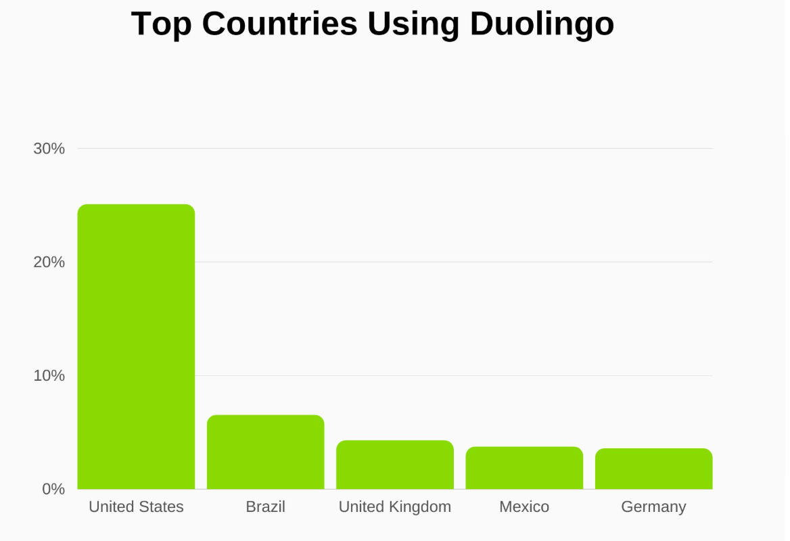

# Highload
Репозиторий курсовой работы по высоконагруженным системам от VK Education (ex. Технопарк).

---

[1. Тема и целевая аудитория](#1-тема-и-целевая-аудитория)

[Список использованных источников](#список-использованных-источников)

---

## 1. Тема и целевая аудитория[^1]

**Duolingo** — бесплатная платформа для изучения языков, также имеющая курсы математики, музыки и шахматам.

### Число активных пользователей[^2]

  - MAU на 2024 год: 97.6 млн
  - DAU на 2024 год: 31.4 млн

### Целевая аудитория[^3]

- По странам:

  

### Требования к функционалу
- MVP:
    - Регистрация и авторизация
    - Выбор языка для изучения
    - Уроки (с делением на темы, множественный выбор, сопоставление слов, аудирование)
    - Система прогресса 
    - Ежедневная цель и трекер
    - Система напоминаний

---

## Список использованных источников

[^1]: https://ru.wikipedia.org/wiki/Duolingo
[^2]: https://investors.duolingo.com/news-releases/news-release-details/duolingo-reports-45-revenue-growth-and-record-profitability
[^3]: https://usesignhouse.com/blog/duolingo-stats/

---